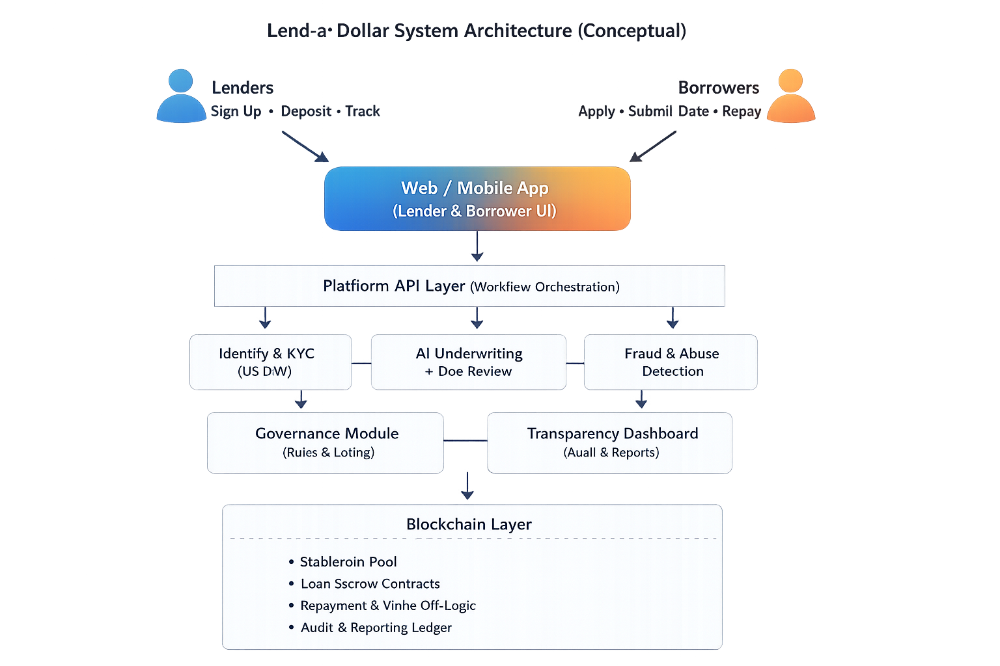

# Lend-a-Dollar – System Architecture (Conceptual)

This diagram represents the *conceptual* architecture of Lend-a-Dollar.
It is not an implementation plan and does not imply production readiness.

---

## High-Level Architecture (Both Lenders and Borrowers Use the App)

## User Flows (Simplified)

### Lender Flow
Lender → App → Identity Verification → Deposit to Pool (stablecoins) → Optional governance → Track impact/returns

### Borrower Flow
Borrower → App → Identity Verification → Submit docs → AI-assisted underwriting (+ manual override) → Loan disbursement → Repayment

---

## Component Responsibilities

### Frontend (Web / Mobile)
- Lender onboarding, deposits, withdrawals
- Borrower onboarding, application, document upload
- Repayment tracking
- Governance participation
- Transparency dashboard

### Platform API Layer
- Orchestrates workflows
- Applies platform rules and caps
- Integrates identity verification
- Routes documents to AI underwriting
- Enforces fraud controls and rate limits

### AI Layer (Assistive, Not Autonomous)
- Documentation parsing
- Eligibility assessment / risk scoring
- Flagging suspicious patterns
- Bias monitoring signals
- Human override supported

### Blockchain Layer
- Custody of pooled funds (stablecoins)
- Loan escrow + accounting
- Transparent repayment tracking
- Write-offs recorded immutably
- Governance voting (optional; could be off-chain initially)

---

## Design Principles
- Impact-first
- Human override always available
- Conservative financial primitives
- Minimal user friction
- No dark patterns
- Radical transparency

---

## Non-Goals
- High-frequency trading
- Token speculation
- Leveraged yield strategies
- Anonymous lending
- Irreversible automation without human review

---

## Trust Boundaries
- Users trust the platform with identity and documents
- Platform enforces ethical rules and caps
- Blockchain provides auditability and transparent accounting
- Governance limits unilateral control
